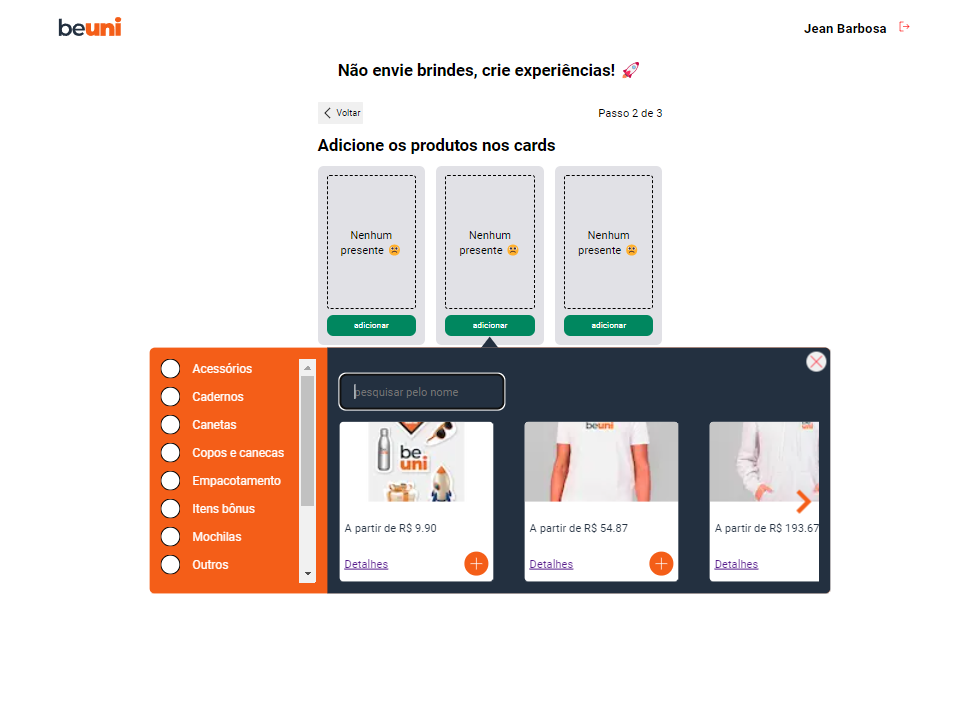

<h3 align="center">
  Surprise Gift
</h3>

<p align="center">

  

  <a target="_blank"  href ="https://github.com/jeanbarbosa/verzel-classroom/stargazers">
    
  </a>
</p>

<p align="center">
  <a target="_blank"  href ="#Classroom">Sobre</a>&nbsp;&nbsp;&nbsp;|&nbsp;&nbsp;&nbsp;
  <a target="_blank"  href ="#information_source-how-to-use">Instalação</a>&nbsp;&nbsp;&nbsp;|&nbsp;&nbsp;&nbsp;
  <a target="_blank"  href ="#tech">Tecnologias usadas</a>
  <a target="_blank"  href ="#memo-license">Licença</a>
</p>

# Surprise Gift

Faça o envio de presentes surpresa com os
seus brindes e produtos personalizados
de maneira mais simples na nossa plataforma! 🧡

## :information_source: How To Use

```bash

# Clone repository:
$ git clone https://github.com/JeanBarbosa/surprise-gift && cd surprise-gift

# Install dependencies API
$ cd api && npm install
$ npx prisma migrate dev
$ npm run start:dev


# Install dependencies WEB
$ cd web && npm install
$ npm run dev

```

Abrir MAILDEV <a href="http://localhost:1080/">http://localhost:1080/</a>

Abrir FRONT END <a href="http://localhost:3000/">http://localhost:3000/</a>

## :information_source: Tecnologias usadas

# Front end

Reactjs (Nextjs)
stitches
radix-ui
reac-hook-form

# Back end

Nestjs
Prisma
MailDev

Banco de dados
Sqlite3

Obs: Foi usado sqlite e comitado o banco e .env para facilitar os testes mas poderia se usado qualquer instancia...

## :memo: License

This project is under the MIT license. See the [LICENSE](https://github.com/jeanbarbosa/verzel-classroom/blob/master/LICENSE) for more information.
